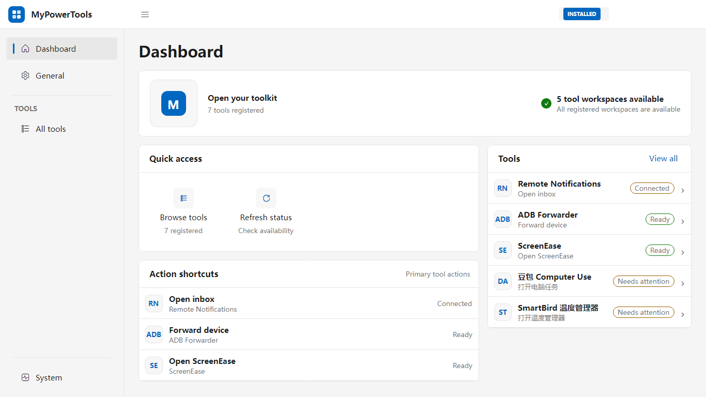
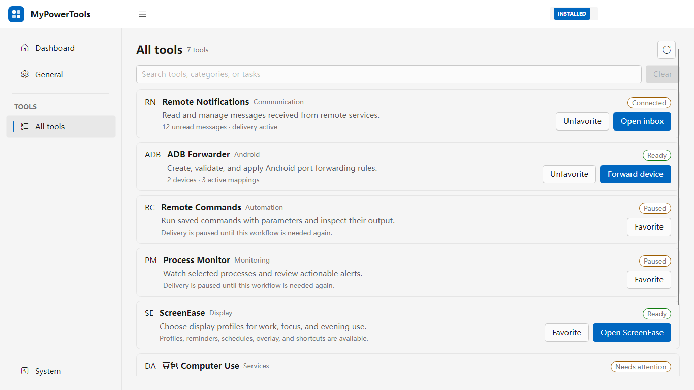

# MyPowerTools

MyPowerTools 是一个集中管理日常小工具的桌面应用。

它把设备管理、系统诊断、显示器调节、图片传输和智能硬件控制放进同一个界面。打开应用即可查看所有工具、运行常用操作并了解当前状态，无需分别寻找和启动多个程序。

## 截图

### 仪表盘

### 全部工具

## 功能

- **本机卡顿专清**：检查 CPU、内存、磁盘、GPU、系统进程和可靠性事件，帮助定位电脑卡顿原因，并提供可确认的清理与恢复方案。
- **ADB Forwarder**：查看 ADB 连接和端口转发状态，集中处理 Android 设备的网络转发。
- **Android Tools**：接收远程通知、执行远程命令、监控指定进程，方便管理 Android 设备。
- **ScreenEase**：查看显示器信息，保存和应用亮度、色温等显示配置。
- **Doubao Agent**：统一查看豆包电脑操作服务的运行状态、配置和日志。
- **Paste Image**：读取剪贴板图片并上传到远程设备，上传完成后自动复制远程路径。
- **SmartBird Thermostat**：查看和控制 SmartBird 温控设备，浏览状态、事件、配置和日志。
- **统一工具入口**：在一个列表中搜索、收藏和打开工具，快速查看每个工具的可用状态。
- **后台常驻**：通过系统托盘保持服务运行，需要时快速打开主界面。
- **状态与提醒**：集中展示工具健康状态、运行日志和通知，出现问题时给出清晰提示。
