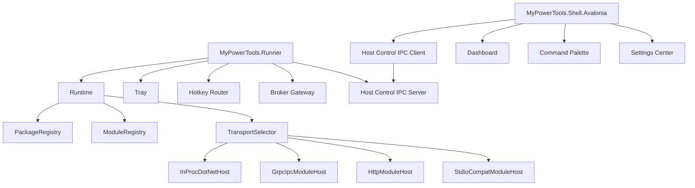

# 系统架构

## 总体分层

```text
MyPowerTools
├─ MyPowerTools.Runner (HostControl IPC Server + Module Runtime)
│  ├─ SingleInstance
│  ├─ Tray / Hotkey Router
│  ├─ Runtime Controller (Catalog + manifest-driven; no tool-specific Supervisor)
│  ├─ Settings Controller
│  ├─ EventBus Host
│  ├─ ModuleHost Supervisor (InProc / GrpcIpc / StdioCompat)
│  ├─ Broker Gateway
│  └─ Host Control IPC Server (named pipe mypowertools.runner.hostcontrol)
│
├─ MyPowerTools.ServiceManager (独立进程 · 唯一服务执行面)
│  ├─ ServiceUnitCatalog (deploy-root manifest loading)
│  ├─ UnitSupervisor (state machine · PID/token re-adoption · breakaway)
│  ├─ UnitLogStore / UnitEventBus
│  └─ ServiceManager IPC Server (named pipe mypewertools.servicemanager.v1)
│
├─ MyPowerTools.Shell.Avalonia (可重启 UI)
│  ├─ Dashboard / Command Palette
│  ├─ Tool Catalog (dynamic, no hardcoded tool IDs)
│  ├─ DotnetSurfaceLoader (collectible ALC + shadow-copy)
│  ├─ System > Services (unified administration page)
│  ├─ ServiceUnitEventStreamMonitor (reactive unit event forwarding)
│  └─ Host Control + ServiceManager IPC Clients
│
├─ MyPowerTools.WebToolHost (底座基础设施 · WebView2 host process)
│
├─ Tool Surface Assemblies (per-tool dotnet-surface packages)
│  ├─ AdbForwarder.Surface
│  ├─ ScreenEase.Surface
│  ├─ RemoteNotifications.Surface
│  ├─ DoubaoAgent.Surface
│  └─ SmartBird.Surface
│
├─ MyPowerTools.AvaloniaSdk (shared SDK)
│  ├─ IMptAvaloniaSurfaceFactory + Context
│  ├─ MptObservableViewModel / MptAsyncRelayCommand
│  ├─ ToolSurfacePageViewModel / ToolSurfaceState
│  └─ ServiceStatusBadge / ServiceRecoveryCard / ServiceLogPreview
│
├─ MyPowerTools.Ipc.Shared (shared gRPC channel factory + bearer-token auth)
│
├─ MyPowerTools.Runtime
│  ├─ PackageRegistry / ToolRegistry (dynamic discovery)
│  ├─ ModuleSupervisor / TransportSelector
│  ├─ CommandIndex / SettingsStore / EventBus / HealthMonitor
│  └─ ScopedServiceUnitClient (IServiceUnitClient)
│
├─ MyPowerTools.Protocol
│  ├─ Module protocol (mpt_module_v1.proto)
│  ├─ Host control protocol (mpt_host_control_v1.proto)
│  ├─ Service manager protocol (mpt_service_manager_v1.proto)
│  └─ Error / Event / Command models
│
├─ MyPowerTools.Platform
│  ├─ Abstractions
│  ├─ Windows
│  ├─ Mac
│  └─ Linux
│
├─ MyPowerTools.Broker
│  ├─ PrivilegedBroker
│  ├─ SecretBroker
│  ├─ ServiceBroker
│  ├─ NetworkBroker
│  └─ AutostartBroker
│
├─ MyPowerTools.UI
│  ├─ Tokens
│  ├─ Components
│  ├─ Layouts
│  ├─ Icons
│  ├─ States
│  └─ VisualRegression
│
└─ MyPowerTools.Packaging
   ├─ Package installer
   ├─ Package verifier
   ├─ Hash manifest
   ├─ Trust store
   └─ Rollback manager
```

## 关键运行链路



## 进程模型

```text
MyPowerTools.Runner.exe
  长期常驻、无控制台窗口（WinExe）。负责模块生命周期、tray、hotkey、settings、event、broker、transport。托盘是用户可见入口。

MyPowerTools.ServiceManager.exe
  独立用户会话守护进程、无控制台窗口（WinExe）。负责 Service Unit 生命周期与再接管。日志写入 data-root/logs。

MyPowerTools.Shell.Avalonia.exe
  UI 进程。负责 Dashboard、Settings、Detail、Logs、Command Palette。从托盘或开始菜单打开。

MyPowerTools.WebToolHost.exe
  SmartBird Web UI 的独立 WinExe。负责 WebView2 controller、子 HWND 与固定同源策略；宿主退出后 Shell 显示回退页面。

module sidecar
  工具 package 自己的 runtime。由 Runner 管理，优先 gRPC over native IPC。

privileged broker
  高权限动作边界。按平台实现，不把权限散落到模块代码。
```

当前故障边界按能力分层：SmartBird 的 Web UI 已建立独立进程崩溃边界；纯 Avalonia 工具页面仍由 Shell 同进程托管；采用 `inproc-dotnet` 的后端模块共享 Runner 进程，同时获得调用预算、取消代际、顺序化故障计数、熔断、隔离清理和经验证卸载后的实例恢复。超时回调若继续运行，模块会停止接收新工作并要求重启 Runner。需要强隔离的后端模块应选择 gRPC/native-IPC sidecar transport。WebToolHost 与 Shell 使用相同用户令牌和完整性级别；第三方 UI 的安全沙箱需要 AppContainer/低完整性进程、capability 声明与 broker IPC。

Shell 可以退出和重启；Runner 仍维持模块状态、命令索引、事件订阅和后台服务。Runner 可以在无 Shell 的情况下处理 tray、hotkey、通知和健康检查。

## 模块加载流程

```text
Runner 启动
读取 package.json
读取 module.json
校验 schema
加载静态 commands.index
建立 CommandIndex
接受 Shell 连接
渲染 Shell 首屏 skeleton
TransportSelector 选择最佳 entrypoint
ModuleHost 建立连接或加载程序集
Initialize module
GetSnapshot
SubscribeEvents
按需加载 UI Surface
```

## Shell 到 Runner 流程

```text
Shell 启动
连接 Runner 的 Host Control IPC
GetDashboardSnapshot
SubscribeHostEvents
渲染 Dashboard
用户执行 command
Shell 调 Runner ExecuteCommand
Runner 调对应 module host
事件经 Runner EventBus 返回 Shell
```

## 传输选择流程

```text
1. 当前 OS / CPU 架构匹配
2. Host 版本和 SDK 版本兼容
3. capability 和 permission 满足
4. entrypoint health check 可用
5. priority 最高
6. runtime 启动成本最低
7. fallback 链路可用
```

## 运行时分工

| 组件 | 职责 |
|---|---|
| `Runner` | 长期控制面和单实例宿主 |
| `Shell` | 可重启 UI 面和用户交互 |
| `HostControl` | Shell 与 Runner 的 typed IPC |
| `TransportSelector` | 根据平台、权限、优先级选择 entrypoint |
| `InProcDotNetHost` | 加载可信 .NET module，直接调用接口 |
| `GrpcIpcModuleHost` | 管理 sidecar 生命周期，建立 gRPC Native IPC |
| `HttpModuleHost` | 包装已有 HTTP/WebSocket 服务 |
| `StdioCompatModuleHost` | 只用于兼容脚本和轻量 fallback |
| `PackageRuntimePool` | 一个 package 共享一个 runtime，多个 module 复用连接 |
| `ModuleSupervisor` | 监控崩溃、重启、超时、降级 |
| `CommandIndex` | 启动时读取静态命令，动态命令后台补充 |
| `SettingsStore` | Host 单一写入方，revision 防冲突 |
| `EventBus` | 统一事件序列、补齐、重放、订阅 |

## 与 PowerToys 的差异

PowerToys 的可借鉴点是常驻 Runner、统一模块接口、复杂工具独立进程承载 UI/服务、Settings UI 与 Runner 分离通信、Command Palette provider 模型。MyPowerTools 保留这些思想，并做以下工程调整：

| PowerToys 模式 | MyPowerTools 定案 |
|---|---|
| Windows Runner 加载模块 DLL | 跨平台 Runner 选择 InProc、gRPC IPC、HTTP、stdio fallback |
| Settings UI 独立进程，经 Named Pipes + JSON 与 Runner 通信 | Shell.Avalonia 独立进程，经 typed Host Control Protocol 与 Runner 通信 |
| Command Palette provider 聚合顶层命令 | CommandIndex + CommandProvider 聚合静态和动态命令 |
| Windows hotkey hook | Platform Pack 统一热键抽象 |
| 模块接口偏 Windows 和 C++ | Typed MPT Protocol + SDK，多语言可生成 |
| UI 由各工具按 Windows 技术栈实现 | Shell 统一 UI Surface、token、组件和视觉回归 |
