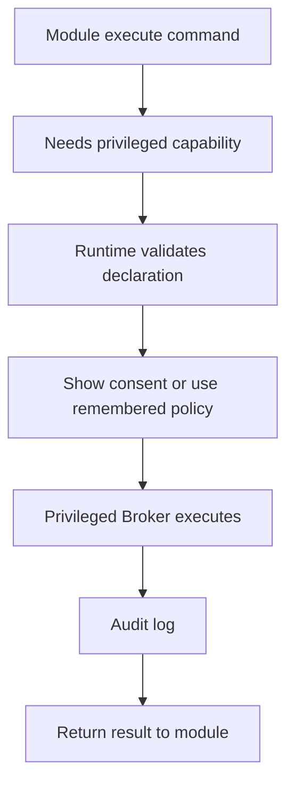

# 跨平台能力包

## 目标

MyPowerTools 的跨平台能力通过 Platform Packs 实现。模块声明自己需要什么能力，Host 根据当前系统找到 provider。

```text
模块声明 capability
Runtime 检查 capability registry
Platform Pack 执行系统 API
Broker 处理高权限动作
Module 接收结果
```

## 能力清单

| Capability | Windows | macOS | Linux | 抽象接口 |
|---|---|---|---|---|
| `tray` | Windows tray | Status Item | AppIndicator | `ITrayService` |
| `hotkey.global` | Win32 hook | Event tap | X11/Wayland provider | `IHotkeyService` |
| `notification.desktop` | Windows notification | UserNotifications | freedesktop notifications | `INotificationService` |
| `clipboard.image` | Win32 Clipboard | NSPasteboard | Wayland/X11 planned | `IClipboardImageService` |
| `network.ssh` | Windows OpenSSH | `/usr/bin/ssh` | OpenSSH | Platform process provider |
| `web.surface` | WebView2 | WKWebView | WebKitGTK planned | `IMptWebSurfaceService` |
| `autostart.user` | Startup / Task Scheduler | launchd agent | systemd user / desktop autostart | `IAutostartService` |
| `service.user` | Task Scheduler / Windows Service | launchd agent | systemd user | `IServiceManager` |
| `service.system` | Windows Service | launchd daemon | systemd service | `IServiceManager` |
| `privilege.elevated` | UAC / helper service | privileged helper | polkit / pkexec | `IPrivilegeBroker` |
| `display.profile` | Win32 / DXGI / DDC | CoreGraphics / DDC | X11 / Wayland / DDC | `IDisplayService` |
| `network.portForwarding` | netsh / firewall APIs | pfctl / socket tools | nftables / iptables / system APIs | `INetworkBroker` |
| `ipc.local` | Named Pipe | Unix domain socket | Unix domain socket | `ILocalIpc` |
| `secret.store` | DPAPI / Credential Manager | Keychain | Secret Service / libsecret | `ISecretStore` |
| `process.inspect` | WMI / ToolHelp | ps / proc APIs | procfs / ps | `IProcessService` |
| `adb.device` | adb CLI | adb CLI | adb CLI | `IAdbService` |

## Capability Registry

```json
{
  "capabilities": [
    {
      "id": "network.portForwarding",
      "permission": "elevated",
      "providers": {
        "windows": "MyPowerTools.Platform.Windows.NetworkBroker",
        "macos": "MyPowerTools.Platform.Mac.NetworkBroker",
        "linux": "MyPowerTools.Platform.Linux.NetworkBroker"
      }
    }
  ]
}
```

## 模块声明

```json
{
  "requires": [
    {
      "capability": "network.portForwarding",
      "required": true,
      "reason": "管理 ADB 端口转发"
    },
    {
      "capability": "adb.device",
      "required": true,
      "reason": "读取 ADB 设备列表"
    }
  ]
}
```

## 降级规则

| 场景 | 模块状态 |
|---|---|
| 必需 capability 缺失 | `unsupported` |
| 可选 capability 缺失 | `degraded` |
| capability 需要权限 | `permissionRequired` |
| 当前平台暂不支持 | `unsupported` |
| Provider 报错 | `degraded` 或 `error` |

## 平台包项目结构

```text
src/MyPowerTools.Platform.Abstractions
  ITrayService.cs
  IHotkeyService.cs
  INotificationService.cs
  IClipboardImageService.cs
  IServiceManager.cs
  IPrivilegeBroker.cs
  IDisplayService.cs
  INetworkBroker.cs
  ISecretStore.cs
  ILocalIpc.cs

src/MyPowerTools.Platform.Windows
src/MyPowerTools.Platform.Mac
src/MyPowerTools.Platform.Linux
src/MyPowerTools.Platform
```

## 当前实现状态

| Area | Status |
|---|---|
| Windows IPC | `LocalIpcService` uses Named Pipe endpoints. |
| macOS/Linux IPC | `LocalIpcService` uses Unix Domain Socket paths. |
| Web surfaces | Windows dispatches to the process-isolated WebView2 host. macOS dispatches to an in-process native `WKWebView` hosted through Avalonia `NativeControlHost`, with origin policy, CSP injection, bridge messages, shortcuts, loading state, and occlusion handling. |
| macOS native providers | Desktop notifications use `UserNotifications`; clipboard image/text access uses `NSPasteboard`; secrets use Keychain; current-user autostart and services use launchd; the Shell tray uses an AppKit `NSStatusItem` with a native 64px Retina Codex quota ring and reset tooltip. |
| Hotkey providers | `IHotkeyService` exists across platform packs. Windows uses a real Win32 `RegisterHotKey` provider with Runner-owned command palette registration; macOS/Linux return explicit `unsupported` states for Event tap and X11/Wayland providers. |
| Privilege broker providers | `IPrivilegeBroker` exists across platform packs. Windows returns `permission-required` through a broker-required provider and `PrivilegedBroker` implements the same contract; macOS/Linux return explicit `unsupported` states for privileged helper/polkit providers. |
| macOS remaining degraded providers | Network, display, hotkey, and privilege providers return explicit unsupported state/messages; process inspection uses the managed runtime. |
| Linux degraded providers | Notification, autostart, service, network, display, tray, hotkey, privilege, and secret providers return explicit unsupported state/messages; process inspection uses the managed runtime. |
| Remaining native validation | Managed `osx-arm64` and `osx-x64` bundles are cross-publish validated. Native dylib compilation, codesign verification, Shell/WKWebView rendering, dynamic Codex quota status item, NSPasteboard, notification activation, launchd, and UDS smoke require a macOS host with Xcode command-line tools. |

## 权限动作流程



## 跨平台优先级

| 阶段 | 平台目标 | 说明 |
|---|---|---|
| P0 | Windows | 先跑通现有工具和 Broker |
| P1 | Linux | 重点验证 Python sidecar、ADB、服务管理 |
| P2 | macOS | 验证 Avalonia Shell、Keychain、launchd |
| P3 | 全平台 package | 完成多平台 mptpkg |
